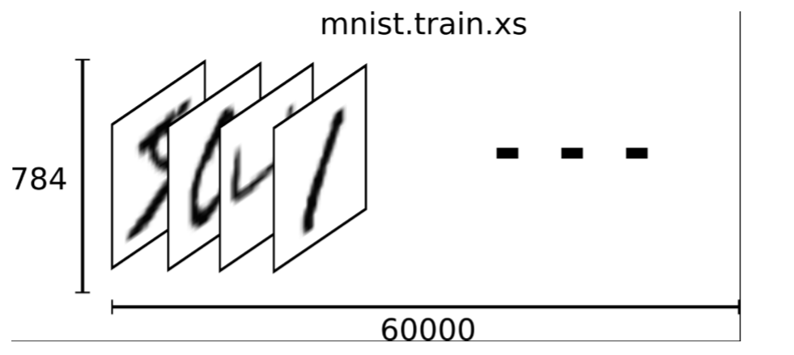
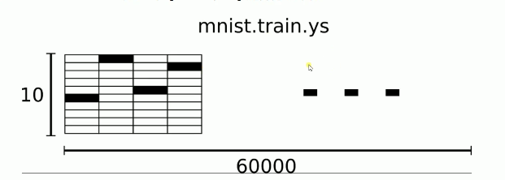
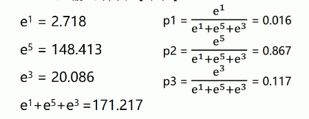

# MNIST数据集
- MNIST数据集官网 [Yann Lecun's Website](http://yann.lecun.com/exdb/mnist/)

- 下载下来的数据集被分成两部分：60000行的训练集 (`mnist.train`) 和10000行的测试数据集 (`mnist.test`)

- 每一张照片包含28 * 28个像素，我们把它展开成一个向量，长度是28 * 28 = 784。 因此在 MNIST训练数据集中`mnist.train.images` 是一个形状为 [60000, 784] 的张量，第一个维度数字用来索引图片，第二个维度数字用来索引每张图片中的像素点。图片里的某个像素的强度值介于 0-1 之间。

    

- MNIST数据集的标签是介于0-9的数字，我们要把标签转化为**one-hot vectors**。 
一个one-hot向量除了某一位数字是1以外，其余数字都是0，比如标签0将表示为 ([1,0,0,0,0,0,0,0,0,0]) ，标签3将表示为 ([0,0,0,1,0,0,0,0,0,0]) 。

- 因此，`mnist.train.labels`是一个 [60000, 10] 的数字矩阵 

    

# SoftMax函数
- 我们知道MNIST的结果是0-9，我们的模型可以推测出一张图片是9的概率是80%，是数字8的概率是10%，然后其他数字概略更小，总体概率加起来等于1。这是一个使用softmax回归模型的经典案例。softmax模型可以用来给不同的对象分配概率。$$softmax(x_i) = \frac {e^{x_i}}{\sum_{j=0}^N{e^x_j}}$$
- 比如输出结果为[1, 5, 3]

    

## 对理论部分了解后，我们来用Tensorflow来事现对手写数字的识别吧。